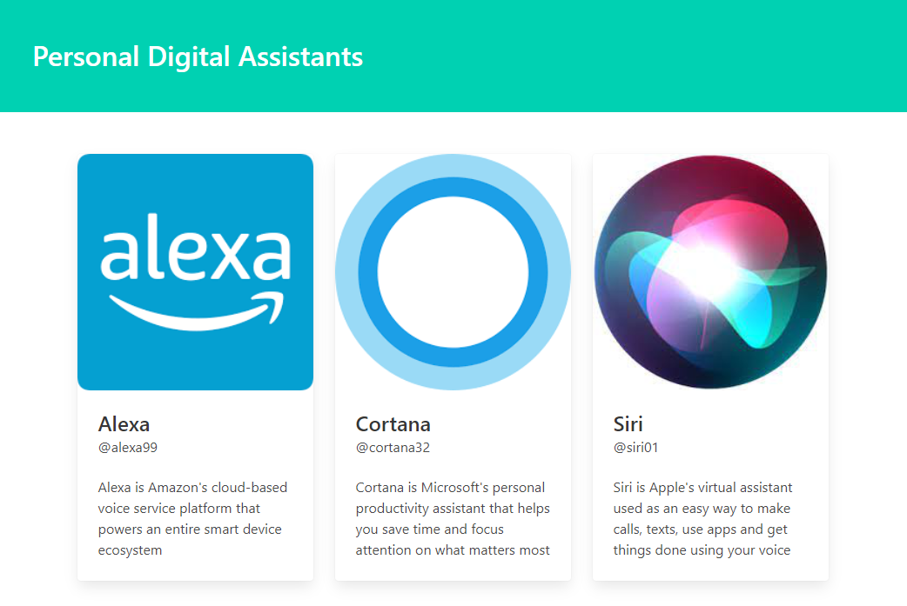

# Personal Digital Assistants App

This is a simple app showing some info on the digital assistant apps Alexa, Cortana and Siri in order to learn using props and how data is passed from a parent component to a child component. The bulma CSS framework was used in order to style the page accordingly